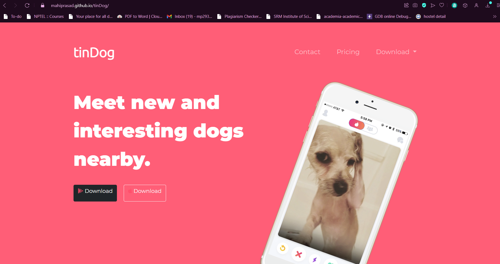

<h1 align="center"> tinDog </h1> 

crafted with &hearts; by Mahi Prasad & Team

 

Built using:
  
   
     

 

## Site Portal

 
 

## Contributors

<table>
<tr align="center">
<th>Team</th>

<td>

Mahi Prasad

  

</td>

<td>

Garima Goel

</td>

</tr>

</table>
